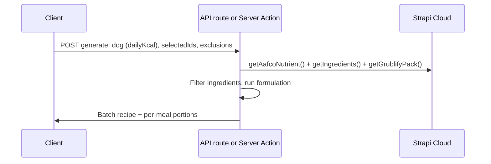

# Recipe generation: AAFCO + Grublify pack

## Goal

Generate a **batch recipe** (user divides it themselves) whose combined nutrients (ingredients + Grublify pack) meet or exceed AAFCO standards. Output includes **per-meal portions** (how much to feed the dog per meal based on their daily kcal).

---

## Data you already have

| Source            | Where                                                                    | Shape                                                                                                                                |
| ----------------- | ------------------------------------------------------------------------ | ------------------------------------------------------------------------------------------------------------------------------------ |
| **Ingredients**   | Strapi Cloud via [getIngredients](src/lib/strapi.ts)                     | [IIngredient](src/types.ts): `nutrients: Record<string, INutrientValue>`, `per100g: boolean`, etc.                                   |
| **AAFCO**         | Strapi Cloud via [getAafcoNutrient](src/lib/strapi.ts)                   | Single type; `data.attributes` (exact keys need typing, e.g. min/max per nutrient)                                                   |
| **Grublify pack** | Strapi Cloud (stored there; add fetch in [strapi.ts](src/lib/strapi.ts)) | Nutrients **same shape as ingredients** (same keys, `{ unit, amount }` per nutrient). No separate Grublify API—all data from Strapi. |

**Note:** AAFCO and Grublify are fetched **on the server only** (see Server-only rules below). Ingredients can be passed from server to client for the selector; AAFCO and Grublify data are never sent to the client.

So: ingredients and Grublify both use the same nutrient keys; AAFCO will have min (and possibly max) for those same (or mappable) nutrients.

---

## Where does "server" run? (Next.js vs Strapi Cloud)

**"Server-only" means: not in the browser.** You have two valid options:

- **Option A – Next.js server (what this plan assumes):** The "server" is your Next.js app. Use a **Next.js API route** (e.g. `src/app/api/generate-recipe/route.ts`) or a **Server Action**. That route runs on your Next.js server (or serverless function when deployed). It fetches AAFCO, ingredients, and Grublify pack **all from Strapi Cloud** (via getAafcoNutrient, getIngredients, getGrublifyPack in strapi.ts), then runs the formulation in that same Next.js process. Strapi is the single data source; Next.js does the orchestration and formulation.
- **Option B – Strapi Cloud:** You could instead add a **custom Strapi route/controller** that does the formulation (using AAFCO, ingredients, and Grublify data already in Strapi), and have Next.js call that Strapi endpoint. Then "server" = Strapi. The plan would change to "implement generate endpoint in Strapi" instead of "Next.js API route."

This plan is written for **Option A** (Next.js API route or Server Action). If you prefer Option B, replace references to `src/app/api/generate-recipe/route.ts` and `src/lib/recipe-formulation.ts` with "Strapi custom route + server-side formulation in Strapi."

---

## Server-only rules (no leaking)

All of the following must run **on the server only** (Next.js API route / Server Action, or Strapi custom route—depending on which option you chose above). Never expose raw data or tokens to the client.

- **AAFCO fetch** – Call `getAafcoNutrient()` only in API routes or Server Actions. Never send raw AAFCO guidelines or the Strapi token to the client. The client only receives the final recipe output.
- **Grublify pack fetch** – Fetch Grublify pack from **Strapi Cloud** only from the backend (same as AAFCO and ingredients, using the existing Strapi token in [strapi.ts](src/lib/strapi.ts)). Never expose raw Grublify nutrient data to the client.
- **Formulation logic** – Run only on the backend. It consumes AAFCO and Grublify data and must live in a server-only module (e.g. `src/lib/recipe-formulation.ts`) and be invoked only from the generate API or Server Action. The client sends inputs (daily kcal, selected ingredients, exclusions) and receives only the final recipe (batch + per-meal portions), not guidelines or pack data.

---

## High-level flow

1. **Client** – On "Generate recipes", send to server: dog daily kcal (and optionally meals per day), selected ingredient IDs, excluded allergen names, excluded ingredient IDs.
2. **Server** – Fetch AAFCO, all ingredients (or only selected), and Grublify pack **from Strapi Cloud**. Filter out excluded ingredients and ingredients that contain excluded allergens.
3. **Formulation** – Solve for ingredient weights (and Grublify amount) so that the **blended batch** meets AAFCO minimums (and max if present). Optionally scale batch size so total kcal matches a target (e.g. 7 days × daily kcal).
4. **Response** – Return batch recipe (ingredient + grams) + **per-meal portion** (e.g. "Feed X g per meal, 2 meals/day" from daily kcal).

---

## Where to implement

**Server-only:** Generate API, AAFCO fetch, Grublify fetch, and formulation logic run only on the backend. The client never receives AAFCO data, Grublify data, or formulation code.

| Piece                               | Location                                                                                                                                              | Notes                                                                                                                                                                                                                                                                                                                      |
| ----------------------------------- | ----------------------------------------------------------------------------------------------------------------------------------------------------- | -------------------------------------------------------------------------------------------------------------------------------------------------------------------------------------------------------------------------------------------------------------------------------------------------------------------------- |
| **Pass dog context into generator** | [GeneratorTabs](src/components/RecipeGenerator/GeneratorTabs.tsx) → [RecipeGeneratorClient](src/components/RecipeGenerator/RecipeGeneratorClient.tsx) | Client: lift daily kcal (and optionally meals/day) from dog details; pass as props or context so "Generate" can send user input to the API.                                                                                                                                                                                |
| **Generate API**                    | New route, e.g. `src/app/api/generate-recipe/route.ts` (or a Server Action)                                                                           | **Server-only.** Accept POST: `dailyKcal`, `selectedIngredientIds`, `excludedAllergens`, `excludedIngredientIds`. Call getAafcoNutrient(), getIngredients(), getGrublifyPack() (all from [strapi.ts](src/lib/strapi.ts)); run formulation; return only batch + per-meal portions. Never return AAFCO or Grublify raw data. |
| **AAFCO fetch**                     | [strapi.ts](src/lib/strapi.ts) (existing getAafcoNutrient)                                                                                            | **Server-only.** Fetches from Strapi Cloud. Used only by the generate API/action. Never import in client components or expose response to the client.                                                                                                                                                                      |
| **Grublify pack fetch**             | [strapi.ts](src/lib/strapi.ts) (add getGrublifyPack)                                                                                                  | **Server-only.** Fetches Grublify pack from Strapi Cloud (same token as AAFCO/ingredients). Return nutrients in same shape as ingredient nutrients. Call only from generate API. Never expose to client. No separate Grublify API—data lives in Strapi.                                                                    |
| **Formulation logic**               | New module, e.g. `src/lib/recipe-formulation.ts`                                                                                                      | **Server-only.** Import only in the generate API/action. Input: AAFCO min/max, ingredients, Grublify nutrients. Output: `{ ingredients: { documentId, name, grams }[], grublifyGrams?, totalGrams, totalKcal, perMealGrams }`. Client never imports or receives formulation internals.                                     |
| **handleGenerate**                  | [RecipeGeneratorClient](src/components/RecipeGenerator/RecipeGeneratorClient.tsx)                                                                     | Client: POST user input to generate API; display returned recipe (batch + feeding). No AAFCO, Grublify, or formulation on client.                                                                                                                                                                                          |

---

## Formulation (meet AAFCO + include Grublify)

- **Nutrient alignment** – Ensure AAFCO, ingredients, and Grublify use the same (or a mapped) set of nutrient keys (e.g. "Crude Protein", "Fat", "Calcium"). You may need a small mapping layer if Strapi/AAFCO use different names.
- **Blend** – For a batch of total mass `M` (e.g. 1000 g), recipe = list of (ingredient, weight_grams). Sum for each nutrient: `sum over i of (ingredient_i.nutrients[n].amount * weight_i / 100)` (if nutrients are per 100g). Add Grublify contribution: same formula using Grublify nutrients and `grublify_grams`.
- **AAFCO** – Guidelines are usually per kg DM (dry matter) or per 1000 kcal. You’ll convert your blend’s nutrients to that basis (e.g. per 1000 kcal) and check each nutrient ≥ min and ≤ max (if you have max).
- **Solver** – Options: (1) **Simple heuristic**: start from a base mix (e.g. equal parts or fixed protein source + carb + veg), add Grublify, then adjust amounts iteratively to meet AAFCO. (2) **Linear programming (LP)**: variables = weight per ingredient + Grublify; constraints = AAFCO min/max and total mass; objective = e.g. maximize inclusion of selected ingredients or minimize cost. A library (e.g. javascript-lp-solver or a small Python microservice) can do this. Start simple; move to LP if you need better solutions.
- **Portions** – From `dailyKcal` and batch total kcal: `portionPerMeal = (dailyKcal / batchTotalKcal) * batchTotalGrams / mealsPerDay`. Return `perMealGrams` and optionally `mealsPerDay` so the UI can say "Feed X g per meal".

---

## Concrete steps (order)

All server-side work (steps 1–5) stays in API routes, Server Actions, or server-only lib modules. Never expose AAFCO data, Grublify data, or formulation logic to the client.

1. **Type AAFCO response (server-only)** – Inspect Strapi `aafco-nutrient` single-type response (e.g. temporary log in the existing [aafco-nutrients route](src/app/api/aafco-nutrients/route.ts); do not return raw `data` to the client). Define a type (e.g. `IAafcoNutrient`) with min/max per nutrient and use it in [strapi.ts](src/lib/strapi.ts). AAFCO is only ever fetched and used on the server.
2. **Add Grublify pack fetch (server-only)** – Add `getGrublifyPack()` in [strapi.ts](src/lib/strapi.ts) that fetches the Grublify pack content from **Strapi Cloud** (same Strapi token as AAFCO/ingredients). Return nutrients in the same format as ingredient nutrients. Call it only from the generate API or Server Action; never from client code. No separate Grublify API—all data is in Strapi.
3. **Fix Strapi populate** – [getAafcoNutrient](src/lib/strapi.ts) passes `{ populate: "*" }` but `fetchStrapi` expects `Record<string, string>`. Use valid query params (e.g. `{ "populate": "*" }`) so AAFCO nested data is returned. This remains server-only.
4. **Recipe generate API (server-only)** – New POST route (or Server Action) at e.g. `src/app/api/generate-recipe/route.ts`. Read body (dailyKcal, selectedIds, exclusions). On the server only: call getAafcoNutrient(), getIngredients(), getGrublifyPack() (all from strapi.ts, all from Strapi Cloud); filter ingredients; call formulation; return only batch + per-meal portions. Do not return AAFCO or Grublify raw data.
5. **Formulation module (server-only)** – Implement `formulateRecipe(aafco, ingredients, grublifyPack, options)` in e.g. `src/lib/recipe-formulation.ts`. This module must run only on the backend (imported only by the generate API or Server Action). Start with a simple heuristic (e.g. proportional mix + Grublify) that meets AAFCO; refine with LP later if needed.
6. **Wire client** – GeneratorTabs passes `dogDetails` (or at least `dailyCalories`) into RecipeGeneratorClient. handleGenerate POSTs to the generate API with user input only; on success, display the returned recipe (batch + "Feed X g per meal, N meals/day"). The client never receives or uses AAFCO, Grublify, or formulation code.

---

## Per-meal portion note

You said batch + portions per meal. So output shape can be:

- `batch: { ingredients: { documentId, name, grams }[], grublifyGrams?, totalGrams, totalKcal }`
- `feeding: { perMealGrams: number, mealsPerDay: number }` (derived from `dailyKcal` and `batch.totalKcal`).

If you later let the user choose meals per day (e.g. 2 vs 3), pass that from the form into the API and use it in `feeding.mealsPerDay`.

---

## Summary

You need: (1) typed AAFCO and a Grublify pack fetch from **Strapi Cloud** (both **server-only**, via [strapi.ts](src/lib/strapi.ts), never exposed to the client), (2) a **server-only** formulation step that combines ingredients + Grublify to meet AAFCO and outputs batch + per-meal portions, (3) one **server-only** generate API that fetches AAFCO, ingredients, and Grublify from Strapi and runs formulation, returning only the final recipe to the client, and (4) client UI to send user input and display the recipe and feeding instructions. Start by typing AAFCO and adding getGrublifyPack() in strapi.ts; then implement the formulation module and the generate API (all backend); finally wire the button and results UI on the client.

---

## Plan review and coding standards

- **Separation of concerns:** Client only sends input and displays output; all AAFCO, Grublify, and formulation logic lives on the server. Clear boundary.
- **Secrets:** Strapi token (e.g. `STRAPI_API_TOKEN`) used only in server code; env vars never in client bundles. No separate Grublify API—Grublify data is in Strapi, so one token covers all fetches.
- **Typing:** Plan calls for typing AAFCO response (`IAafcoNutrient`) and consistent shapes for ingredients and Grublify nutrients; keeps formulation and API contracts maintainable.
- **Single responsibility:** `recipe-formulation.ts` does formulation only; API route orchestrates (fetch → filter → formulate → respond). [strapi.ts](src/lib/strapi.ts) is the single place for all Strapi fetches (AAFCO, ingredients, Grublify pack).
- **No raw data leakage:** API returns only `{ batch, feeding }`; never AAFCO min/max or Grublify nutrient tables to the client.
- **Progressive complexity:** Formulation starts with a simple heuristic; LP or other solvers are a later refinement. Good for iterative delivery.
- **One place for "server":** The plan assumes Next.js API route / Server Action as the server. If you move orchestration to Strapi Cloud, keep the same rules (server-only fetches and formulation, client only gets final recipe).

